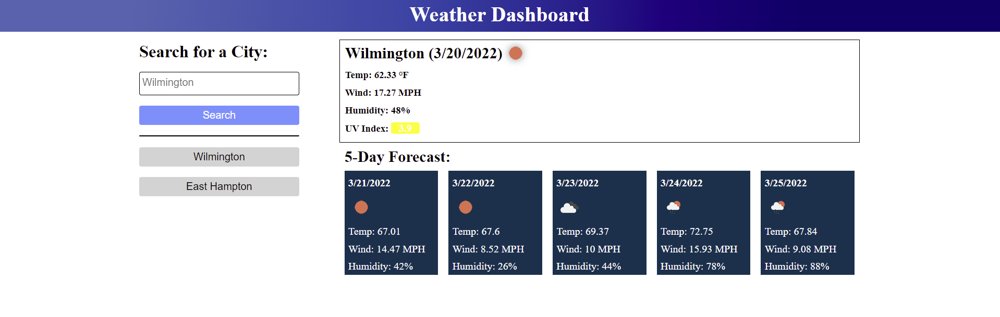

# Weather-Dashboard

  ## Table of Contents
  * [Return to Top](#)
  * [Application Description](#application-description)
  * [Application Dependencies](#application-dependencies)
  * [How to Use](#how-to-use)
  * [Application Built With](#application-built-with)
  * [Screenshot](#screenshot)
  * [Deployed Application](#deployed-application)
  * [Github Repo Location](#github-repo-location)
  * [Contact](#contact)
  
  ## Application Description
  This application was designed to help you check the weather in any city or town you'd like for the next five days and the actualy current weather. If you're traveling or just curious how you're friends in new york are doing today, this is the app for you.
  
  ## Application Dependencies
  * Moment
  
  ## How to Use
  You can use this application by checking the deployed application
  

  ## Application Built With
  * Moment
  * Javascript
  * HTML
  * CSS
  
  ## Screenshot
  

  ## Deployed Application
  [Click Here](https://dsiedlarz90.github.io/Weather-Dashboard/)
  
  ## Github Repo Location
 [https://github.com/DSiedlarz90/Weather-Dashboard](https://github.com/DSiedlarz90/Weather-Dashboard)

  ## Contact
  Email: Dsiedlarz90@gmail.com